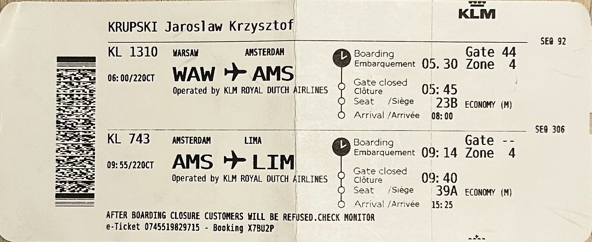
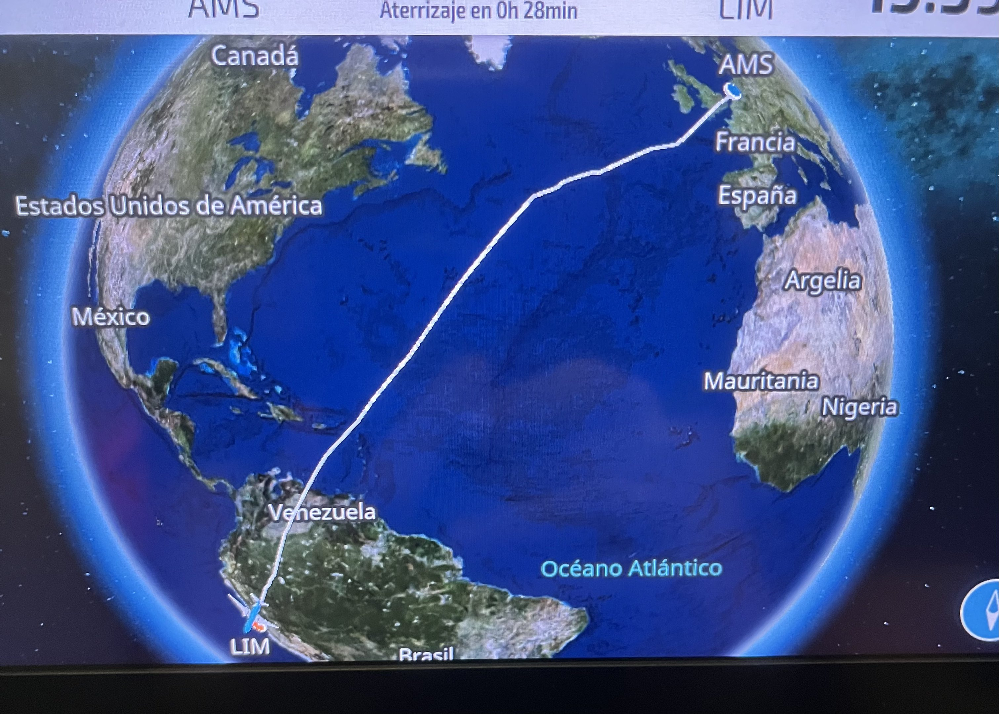

# Dzień 1 – 22.10.2025 – Warszawa → Lima

O  3:00 rano zbieramy się na Lotnisku Chopina, zaspani, z plecakami i walizkami, 
z mieszanką podekscytowania i jesiennego zmęczenia. 
Lot do Amsterdamu był stosunkowo krótki, ale to wystarczyło — wszyscy czuliśmy, że wyprawa zaczyna się na dobre. Później przesiadka i długi lot do Limy — patrzyliśmy przez okna na zmieniające się chmury i oceany, a w sercach rosła niecierpliwość.
Przylecieliśmy wczesnym popołudniem (z uwzględnieniem różnicy czasu): powietrze Limy było wiosenne, suche, z lekkim powiewem chłodnego wiatru znad Pacyfiku. 
Po transferze zameldowaliśmy się w spokojnej dzielnicy - Miraflores.
Zmęczony, zamknąłem na moment oczy i poczułem: „Jesteśmy naprawdę daleko od domu.”  

## Zdjęcia

## Nawigacja

<nav>
  <a href="index.md">⬅ Strona główna podróży</a>
  <a href="dzien2.md">Dzień 2 ➡</a>
</nav>

