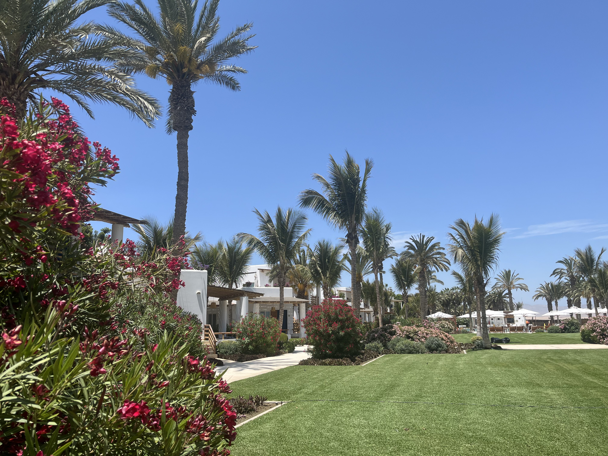
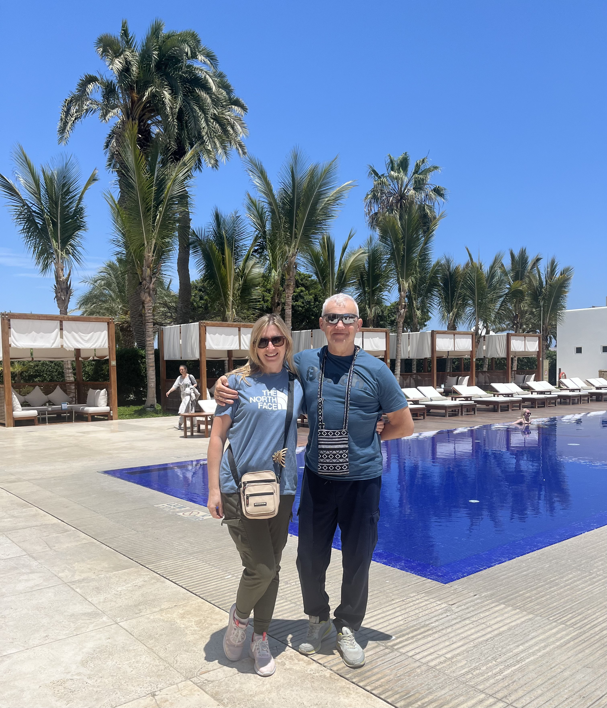
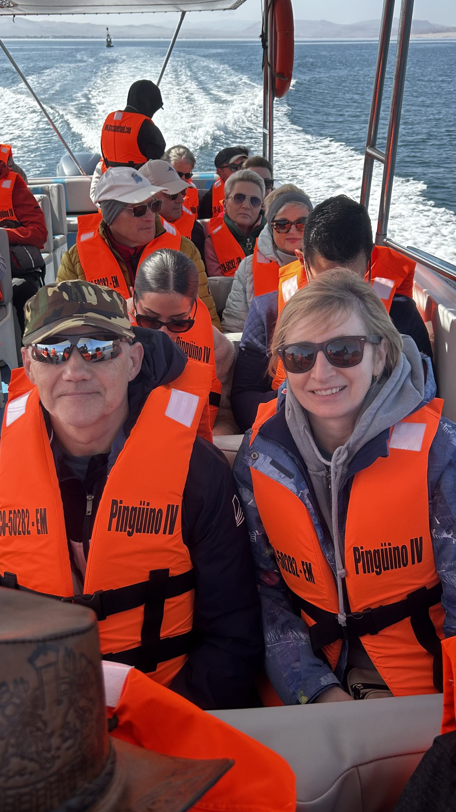
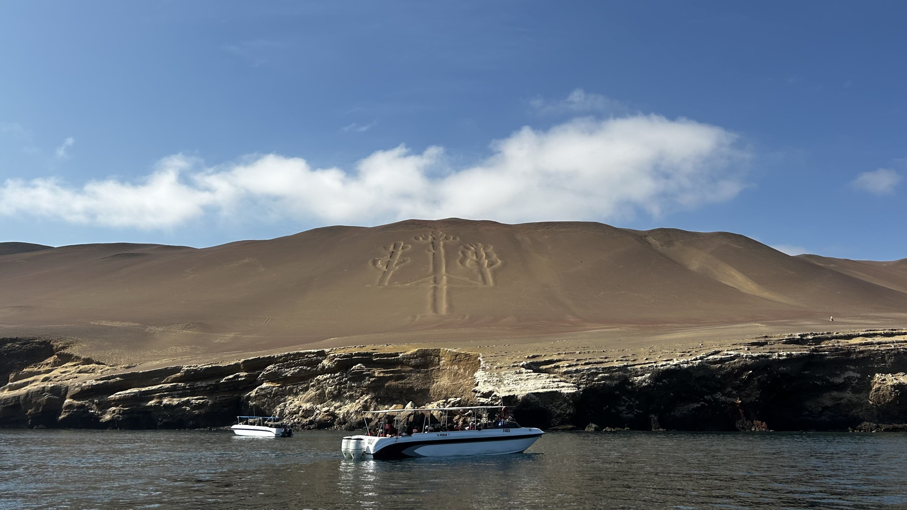
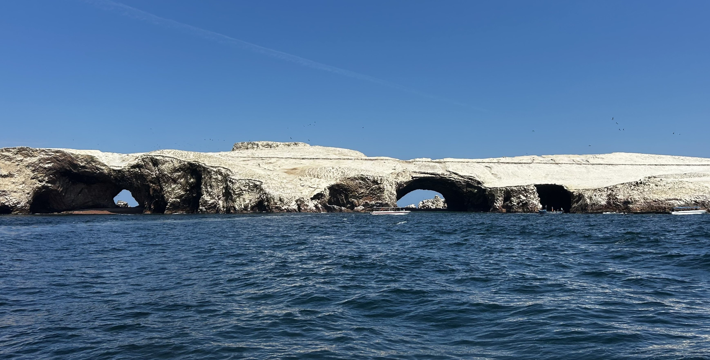
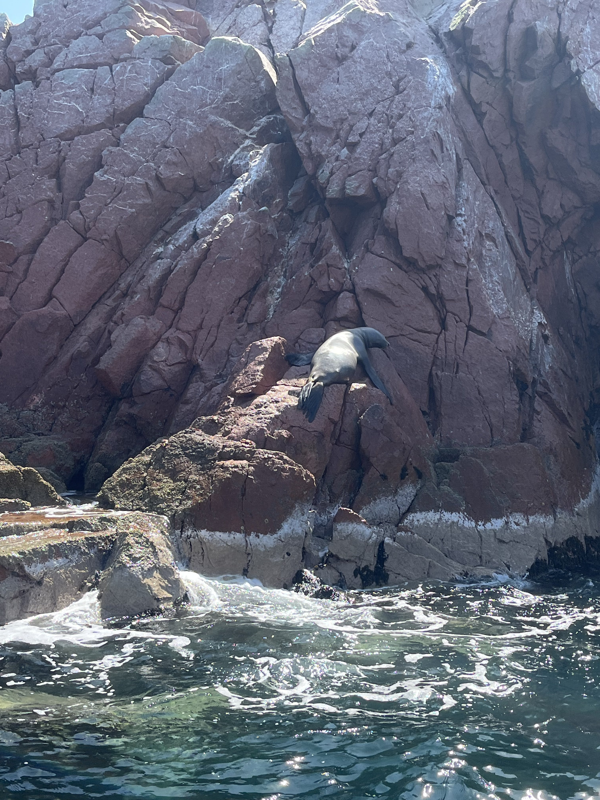
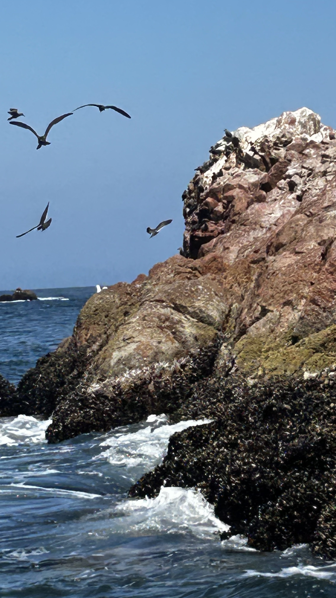
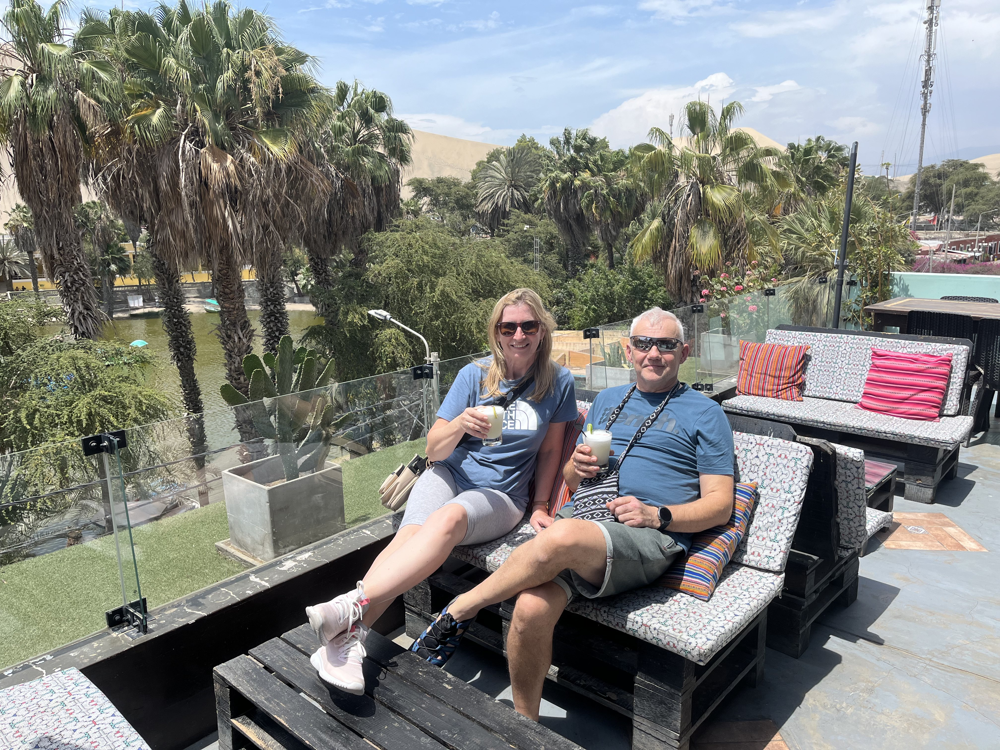

# Dzień 2 – 23.10.2025 – Paracas i Wyspy Ballestas → Nazca

Wyruszamy około 4:00 rano. Przed wyjściem zabieramy suchy prowiant na śniadanie.
Poranek był chłodny, a na drodze – po minięciu ulic Limy – rozpościerała się pustynna panorama.

Po przyjeździe do Paracas nie sposób było nie zauważyć pomnika „ojca Peru” – argentyńskiego generała José de San Martín, który w 1821 roku pomógł poprowadzić rewolucję przeciwko rządom hiszpańskim.
Krótki spacer do portu był naszym pierwszym wiosennym spotkaniem z przyrodą.

<figure>
  
  
  <figcaption>Port w Paracas</figcaption>
</figure>

Wkrótce wsiedliśmy do łodzi motorowej i popłynęliśmy na Ballestas Islands — archipelag skalnych wysepek na Pacyfiku.

<figure>
  
  <figcaption>Rejs łodzią motorową</figcaption>
</figure>

To miejsce bywa nazywane „Małymi Galapagos” — i trudno się temu dziwić.
Podczas dwugodzinnego rejsu zobaczyliśmy kolonie lwów morskich wygrzewających się na skałach, pingwiny Humboldta wypatrujące nas ze wzgórz oraz ogromną liczbę ptaków morskich: kormorany, pelikany i wiele innych.
Wszystko to sprawiało wrażenie, jakby natura zorganizowała tam własną świątynię życia.

Najbardziej tajemnicza była ogromna figura wyryta na wydmie, znana jako **El Candelabro** — geoglif o długości około 180 metrów, widoczny z morza.
Jego pochodzenie i znaczenie pozostają niejasne: nie wiadomo, kto go wykonał, kiedy i po co.
Naukowcy spekulują, że mógł służyć jako znak dla dawnych marynarzy lub mieć znaczenie religijne.

<figure>
  
  <figcaption>El Candelabro – tajemniczy geoglif widoczny z morza</figcaption>
</figure>

Guano – czyli odchody ptaków morskich – przez wieki było niezwykle cennym nawozem i źródłem dochodów dla Peru.
Obecnie, po wyczerpaniu złóż, wyspy stanowią rezerwat przyrody.
Guano nadal jest gromadzone, lecz jego wydobycie zostało ograniczone, a na wyspy można dopływać jedynie łodziami, by obserwować ptaki i pozostałości po dawnej eksploatacji.

<figure>
   
  
  
  <figcaption>Las Ballestas</figcaption>
</figure>

Po powrocie z rejsu spędziliśmy chwilę w kawiarni, a następnie ruszyliśmy w kierunku Nazca.
Po drodze zatrzymaliśmy się przy oazie **Huacachina** — zielonym oku na pustyni, otoczonym złotymi wydmami.

<figure>
  
  <figcaption>Oaza Huacachina – zielona wyspa pośród wydm</figcaption>
</figure>

Tam nastąpiło pierwsze spotkanie z **pisco sour** – peruwiańskim koktajlem na bazie alkoholu pisco, soku z limonki, syropu cukrowego i białka jaja.
Jest uznawany za narodowy drink Peru, a charakterystyczna pianka nadaje mu wyjątkowy wygląd.

Było to chwilowe orzeźwienie przed dalszą podróżą pustynnymi równinami Nazca.
Podążaliśmy Trasą Panamerykańską, która w sumie liczy około 30 000 km.

Wreszcie dotarliśmy do **Muzeum Maríi Reiche**, poświęconego badaniom nad liniami Nazca.
Niemiecka matematyczka María Reiche rozpoczęła swoje badania w 1946 roku i poświęciła im całe życie.
W muzeum zgromadzono mapy, fotografie i materiały archeologiczne dokumentujące jej pracę.

W ogrodzie muzeum znajduje się grób Maríi Reiche, która zmarła w 1998 roku.
Nieopodal wznosi się 13-metrowa wieża widokowa, z której można obserwować fragmenty tajemniczych rysunków.

<figure>
  
  <figcaption>Płaskowyż Nazca</figcaption>
</figure>

Na płaskowyżu Nazca znajdują się setki geoglifów – od prostych linii i figur geometrycznych po ogromne wizerunki zwierząt i roślin.
Do najsłynniejszych należą m.in. pająk, kondor, koliber, małpy, pies, ryby i kwiaty.

Większość naukowców zgadza się z teorią Maríi Reiche, według której linie miały związek z obserwacjami astronomicznymi i kalendarzem rolniczym.
Istnieją też inne hipotezy – od religijnych po bardziej fantastyczne – lecz niezależnie od interpretacji, linie Nazca pozostają jednym z największych archeologicznych fenomenów świata.

## Nawigacja

<nav>
  <a href="dzien1.md">⬅ Dzień 1</a>
  <a href="index.md">Strona główna podróży</a>
  <a href="dzien3.md">Dzień 3 ➡</a>
</nav>
